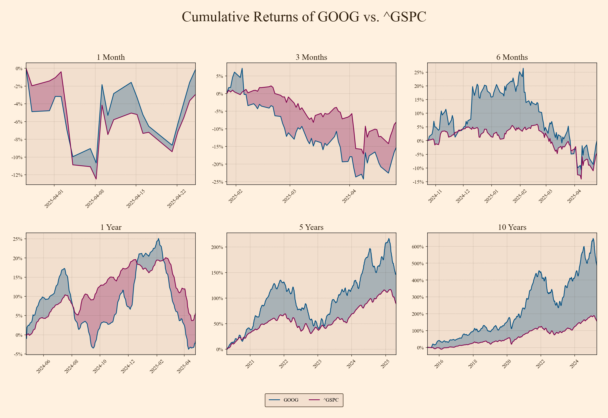

# Stock Cumulative Returns Analyzer


[](https://www.python.org/downloads/)


## Overview

This project provides a Python script (`cr_stock_analyzer.py`) to analyze and visualize the cumulative returns of a specified stock compared to a benchmark (defaulting to the S&P 500 - ^GSPC). It fetches historical data using `yfinance`, processes it with `pandas`, and generates a multi-scope comparison plot using `matplotlib`. The script offers various command-line options for customization, including changing tickers, time periods, and plot aesthetics.

## Features

*   Fetches historical stock data via the `yfinance` library.
*   Retrieves benchmark data (default: S&P 500 ^GSPC).
*   Aligns stock and benchmark data to common trading dates.
*   Normalizes closing prices based on the start date of the overall fetched data.
*   Calculates and plots cumulative returns relative to the start of *each specific scope*.
*   Visualizes comparisons across multiple time scopes: 1 Month, 3 Months, 6 Months, 1 Year, 5 Years, 10 Years.
*   Applies progressive smoothing (rolling mean) for longer timeframes (1Y+) to highlight trends.
*   Generates a 2x3 grid plot for easy comparison across scopes.
*   Offers command-line arguments for customizing:
    *   Stock and benchmark tickers
    *   Data fetching period
    *   Plot colors (stock line, benchmark line, background, text)
    *   Font family
    *   Display options (fill, grid, ticks, labels, legend)
    *   Saving the plot to a file (PNG format) with customizable paths/names.

## Example Output

*(Generated using default settings: GOOG vs. ^GSPC with specific color theme)*



## Setup and Installation

1.  **Clone the repository:**
    ```bash
    git clone https://github.com/marcusrprojects/stock-return-analyzer.git
    cd stock-return-analyzer
    ```
2.  **Create and activate a virtual environment (recommended):**
    ```bash
    # Create
    python -m venv venv
    # Activate (Linux/macOS)
    source venv/bin/activate
    # Activate (Windows CMD)
    # venv\Scripts\activate.bat
    # Activate (Windows PowerShell)
    # venv\Scripts\Activate.ps1
    ```
3.  **Install dependencies:**
    ```bash
    pip install -r requirements.txt
    ```

## Usage

Run the script from your terminal.

**Basic Usage (Defaults: DIS vs ^GSPC, max period, saves to `data_viz/`):**
```bash
python cr_stock_analyzer.py
```

Analyze a different stock (e.g., AAPL) for the last 5 years:
```bash
python cr_stock_analyzer.py -t AAPL -p 5y
```

Change benchmark (e.g., Nasdaq ^IXIC) and output file:
```bash
python cr_stock_analyzer.py -t MSFT -b "^IXIC" -o outputs/msft_vs_nasdaq.png
```

Customize Appearance (e.g., different colors, no fill):
```bash
python cr_stock_analyzer.py -t NVDA --stock-color green --bench-color gray --bg-color white --graph-bg-color lightgray --no-fill
```

Prevent saving the plot:
```bash
python cr_stock_analyzer.py --no-save
```

Show axis labels and use tight X-axis limits:
```bash
python cr_stock_analyzer.py --show-labels --tight-xlim
```

View all options:
```bash
python cr_stock_analyzer.py --help
```


## Files
- `cr_stock_analyzer.py`: The main Python script for analysis and plotting.
- `requirements.txt`: Lists the necessary Python packages with pinned versions for reproducibility.
- `README.md`: This file.
- `data_viz/` (Optional): Default directory where generated plots are saved if no output path is specified. Consider adding this to .gitignore if you don't want generated images tracked by Git.

## Acknowledgements
Data sourced from Yahoo Finance via the yfinance library.
Built with the help of pandas, numpy, and matplotlib.